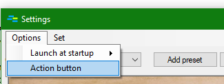

# Windows commo rose
Windows commo rose — simple application that helps you do tasks using only your mouse.
Pressing action button activates *commo rose* — basically a set of rectangles(performers) around cursor where each of them contains useful command.

## Use case scenarios
### Working with clipboard

### Explorer

## Action button
By default action button is set to middle mouse button. To change that go to Options->Action button

## Presets
Preset — set of performers that serve common purpose. For example you may wish to create preset for your favourite text editor. You can consider adding performers to copy and paste text, select whole line, delete whole line, comment out line and so on.

To create preset click button "Add preset" and enter name

Next, add a couple of performers. To add performer click "Add performer". Give it a name, choose type of action(in our example it will just simulate 'ctrl+c') and finally click apply to save changes. Also, you can additionaly customize performer by changing its backcolor, textcolor or font.

Slightly complicated performer to comment out current line.

Actual "commenting" is done by this sequence of operations: send(home) runSilent(cmd /c echo|set /p=//| clip) send(ctrl+v)

Finally, associate preset with notepad. To do this click "Bind to a process"

Let's test out our preset.

## Note about binding
If a process of currently focused window haven't been bound to any preset application will use default preset. If the process bound to several presets one of them would be used(but which one is undefined).

## Troubleshooting
*Commo rose doesn't show up when focus is on certain windows.*

It may happen if process of that window is elevated process and commo rose launched without administrator privileges. To resolve issue just restart application as administrator.
